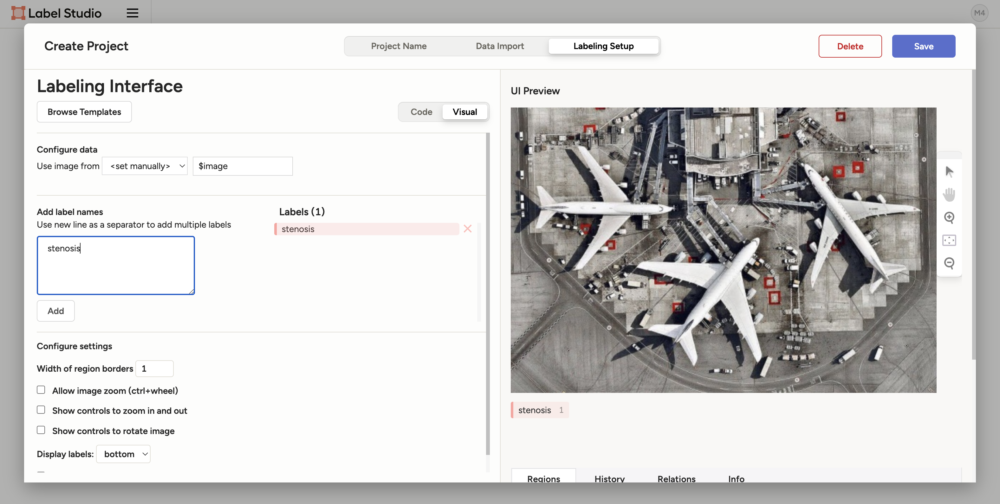
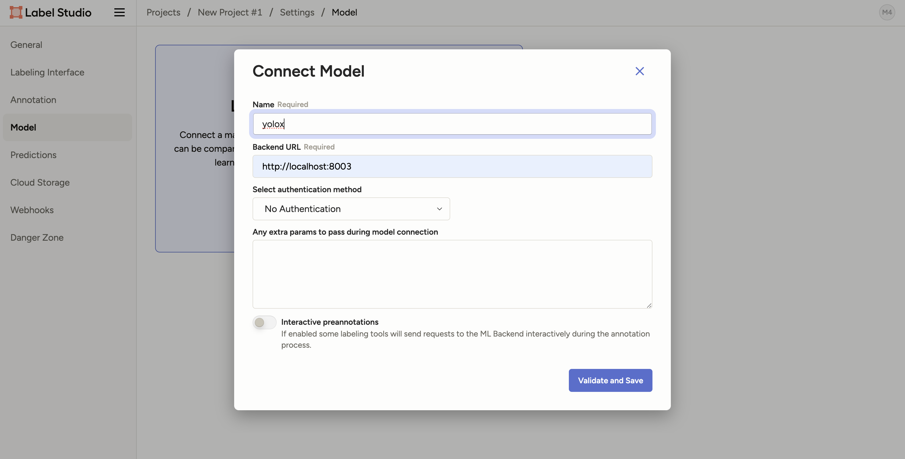

# Manual for auto-labeling with learnt parameters from mmdetection

1. **Ripositoryのclone:**\
このRipositoryのclone $\rightarrow$ labelstudioディレクトリに移動。
   ```bash
   git clone git@github.com:m4thphobia/labelstudio.git
   ```
   ```bash
   cd labelstudio
   ```
2. **イメージのビルド:**
   ```bash
   sh build.sh
   ```
3. **コンテナの作成:**
   ```bash
   sh run.sh
   ```
4. **label-studioの起動(back goundでYOLOXが動くようになってる):**
   ```bash
   sh start.sh
   ```
5. **ブラウザでlabel-studioへ:**\
   4.の後少し待つと何文か出力されるので, 以下の文を探してブラウザで at 以降にアクセス(この場合だとhttp://0.0.0.0:8004/)。

   run.shとstart.shを書き換えればportは変更可能。
   ```bash
   Starting development server at http://0.0.0.0:8004/
   ```
6. **label-studioにsign up**\
   5.によってlabel-studioのログイン画面が出てくるので適当なアカウント名とパスワードで Sign up。あくまでローカルのサーバーなのでアカウント登録してもサーバーを閉じるとアカウントも作業内容も消えるので注意。


7. **Projectの設定**\
Sign upすると以下ような画面になる。Create Project $\rightarrow$ Project Name Project $\rightarrow$ Date Import $\rightarrow$ Labeling Setup。


8. **Labeling Setup**\
Labeling Setupでは"Object Detection with Bounding Box"を選択 $\rightarrow$ labelを変更 $\rightarrow$ save(labelの色も変更可能)。




9. **Backendで動くModelを設定**\
右上のsettingからModelを選択 $\rightarrow$ Backend urlを設定(名前は任意)。Backend urlはrun.shとstart.shで変更可能。





10. **Annotation**\
"Label All Task"でannotation開始。手動でannotationするときは左下のstenosisラベルを選択すれば可能。


